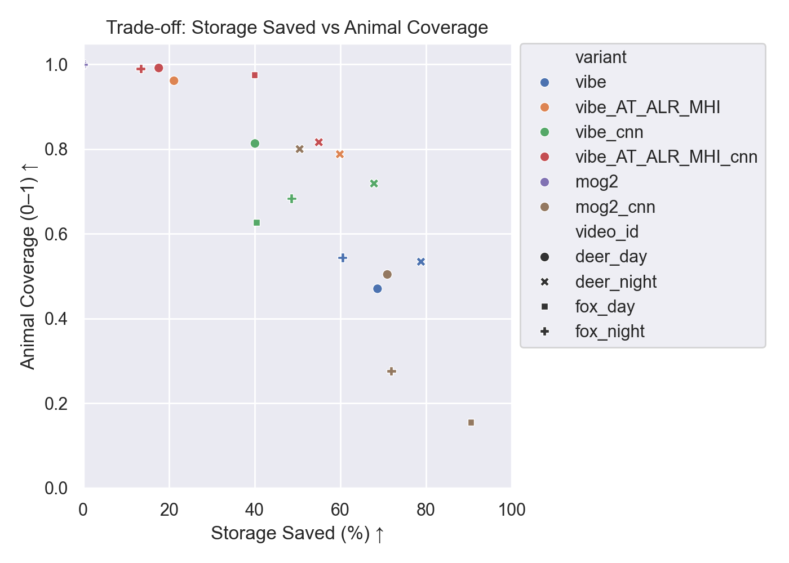
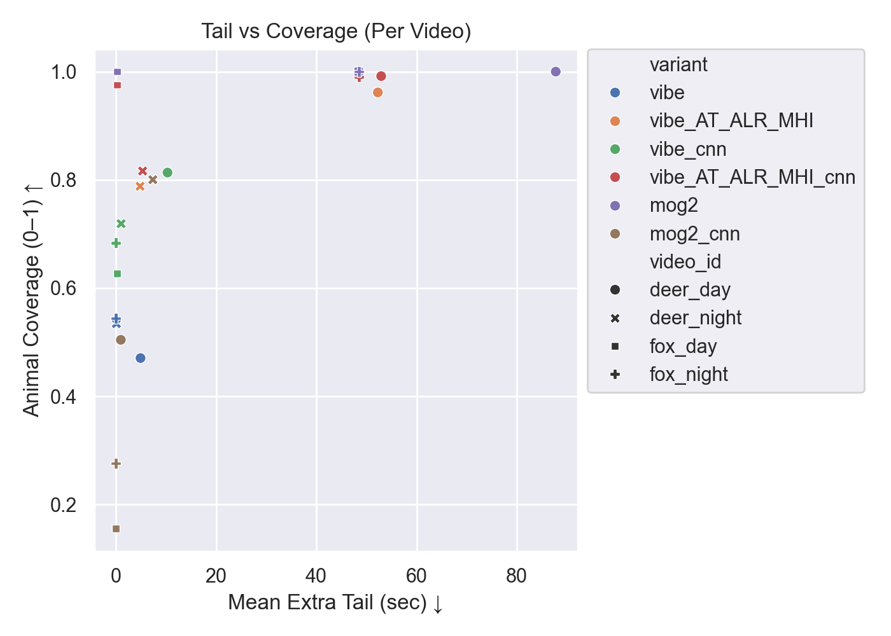
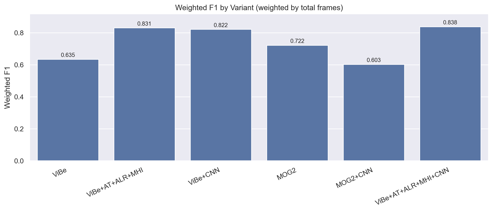

# Wildlife Motion Gate (ViBe + MHI + MotionNet) — Edge-Friendly Wildlife Recording

This repo implements a **motion-triggered recording gate** for wildlife camera videos under **edge like constraints** (Docker with limited resource).  
The goal is **not just detecting that an event happened**, but **preserving the full animal behavior** while still saving storage.

**Core idea:**  
**START strict, STAY smart.**  
We start clips using a strict motion signal (background subtraction), then keep clips using **temporal persistence** (MHI) and/or a lightweight **CNN presence latch** (MotionNet: distilled MobileNetV3-Small on motion crops).

---

## Method (30-second overview)

```
Video frames
   │
   ├─► ViBe (background subtraction) ─► motion mask ─► start trigger (strict)
   │
   ├─► MHI (motion history image) ────────────────► stay trigger (bridges gaps)
   │
   └─► MotionNet (CNN on motion crops) ───────────► semantic confirmation + presence latch
                                     (optional; throttled for edge)
   │
   └─► ClipGate state machine (pre-roll + post-roll) ─► keep/drop each frame
```

### Why this matters
- **Pure motion gating** often drops subtle behavior (animal standing, slow head movement).
- **MHI** bridges motion flicker and improves within-event continuity.
- **CNN latch** reduces false positives and can keep clips alive when motion weakens.

---

## Literature review (why AT/ALR + ViBe)

This project builds on classic **background subtraction** (BS) for efficient motion gating, and specifically on **ViBe**-style sample-based BS which is lightweight enough for edge deployment.

### α‑ViBe (Adaptive ViBe) for dynamic scenes
A key reference that motivated the **AT/ALR** components in this repo is the IEEE paper **“Adaptive Motion Detection for Enhanced Video Surveillance”** (Mpofu et al., 2024). The paper improves ViBe robustness under **dynamic backgrounds** and **illumination changes** by adding:

- **Adaptive Learning Rate (ALR):** background update speed is adjusted using **motion intensity** (more motion → slower adaptation to avoid absorbing foreground).
- **Adaptive Thresholding (AT):** the minimum matches / decision threshold is adjusted using **frame mean intensity** (better behavior across lighting conditions).
- **HSV-based shadow handling:** distinguishes shadows from true objects (reduces false positives).
- **Gaussian blur initialization:** low-cost denoising / stabilization for the background model.

The paper’s ablation study highlights the trade-off:
- **ALR tends to improve recall** in dynamic scenes (but can increase false positives if too permissive).
- **AT helps maintain precision** across lighting variation.

### How this repo extends the literature (wildlife behavior preservation)
Surveillance-style motion detection optimizes “moving object present”, but **wildlife monitoring** needs **behavior coverage** (keep frames even when motion becomes subtle).  
So we keep ViBe+AT/ALR for **efficient start triggers**, then add:

- **MHI** to bridge short motion gaps and improve within-event continuity.
- **MotionNet (CNN latch)** to add semantic confirmation and keep the gate alive when motion weakens.

This combination targets a **new objective**: maximize **Animal_Coverage** while still saving storage on edge devices.


## Distilled ROI Classifier (Teacher–Student)

To reduce false triggers while keeping the model lightweight for edge deployment, we train a compact **MobileNetV3-Small** binary classifier that predicts **animal vs. background** on ROI crops produced by the motion pipeline.

### Knowledge Distillation Setup
- **Teacher:** `YOLO11x-cls` (image classifier)
- **Student:** `MobileNetV3-Small` (binary ROI classifier; deployed as the lightweight confirmation network)
- **Training data:** ROI-cropped images from the **Caltech Camera Traps (CCT/CCT20)** dataset, organized into `train/val/test` splits.
- **Labels:** single class `animal` + a negative class `background/no_animal` (e.g., empty motion ROIs / hard negatives).

### No Train–Test Leakage (Benchmark Holdout)
- The **benchmark videos used for evaluation are strictly held out** and **were not used for training or validation** of either the YOLO teacher or the distilled MobileNetV3-Small student.  
- This ensures reported performance reflects generalization to unseen videos rather than memorization of the benchmark set.
---

## Results (edge-simulated constraints)

These numbers are from a Docker run that approximates Jetson-class limits (see `README_DOCKER.md`).  
Metrics are aggregated across four benchmark videos: `deer_day`, `deer_night`, `fox_day`, `fox_night`.

> **Key metric for “behavior preservation”:** `Animal_Coverage` (0–1). Higher = more of the animal timeline retained.

### Leaderboard (aggregate)

| Variant                           |   Precision |   Recall |    F1 | Coverage   | StorageSaved   | Delay   | Tail   |   FPS |
|:----------------------------------|------------:|---------:|------:|:-----------|:---------------|:--------|:-------|------:|
| ViBe + AT + ALR + MHI + MotionNet |       0.736 |    0.965 | 0.835 | 0.957      | 26.9%          | 0.23s   | 37.62s |  36.5 |
| vibe_AT_ALR_cnn                   |       0.736 |    0.963 | 0.834 | 0.801      | 27.1%          | 2.58s   | 9.24s  |  29.8 |
| ViBe + AT + ALR + MHI             |       0.742 |    0.938 | 0.828 | 0.939      | 29.5%          | 0.23s   | 37.23s |  46.2 |
| ViBe + MotionNet (CNN latch)      |       0.864 |    0.795 | 0.828 | 0.741      | 48.7%          | 1.73s   | 4.70s  |  35.3 |
| vibe_MHI_cnn                      |       0.809 |    0.806 | 0.807 | 0.808      | 44.4%          | 0.41s   | 7.22s  |  32.3 |
| vibe_AT_ALR                       |       0.729 |    0.864 | 0.791 | 0.855      | 34.0%          | 2.32s   | 37.08s |  36.6 |
| vibe_MHI                          |       0.806 |    0.738 | 0.771 | 0.717      | 48.9%          | 0.65s   | 6.88s  |  43.1 |
| vibe_AT                           |       0.782 |    0.726 | 0.753 | 0.728      | 48.2%          | 0.66s   | 9.24s  |  35.1 |
| vibe_ALR                          |       0.742 |    0.629 | 0.681 | 0.690      | 52.7%          | 2.65s   | 9.58s  |  37   |
| ViBe (baseline)                   |       0.858 |    0.521 | 0.649 | 0.554      | 66.1%          | 2.71s   | 2.18s  |  34.6 |
| MOG2 (baseline)                   |       0.567 |    1     | 0.724 | 1          | 0.0%           | 0.00s   | 60.75s | 370.6 |
| MOG2 + MotionNet                  |       0.858 |    0.476 | 0.612 | 0.46       | 68.6%          | 3.32s   | 1.79s  | 362.2 |

### Key plots (for the README)

<p align="center">
  
</p>

<p align="center">
  
</p>

<p align="center">
  
</p>


### Recommended configs
- **Default (edge-real-time, behavior-preserving):** `ViBe + AT + ALR + MHI`
- **Max behavior (upper bound):** `ViBe + AT + ALR + MHI + MotionNet` (highest F1/recall, but can add long tails → tune `tau` / stay threshold)
- **Storage-first baseline:** `ViBe (baseline)` (highest storage saved, but lowest behavior coverage)
- **Precision-oriented option:** `ViBe + MotionNet (CNN latch)` (higher precision and storage saved, but can start later)

### One “story” figure to include in README
Use the **Storage Saved vs Animal Coverage** plot (trade-off curve).  
It directly shows the research goal: **save storage without losing behavior**.

---

## Reproduce (3 commands)

### Option A: Local (recommended for development)
```bash
pip install -r requirements.txt
python scripts/run_all_ablations.py 
python scripts/eval_mog2_cnn.py --config configs/standard/mog2.yaml
python scripts/eval_mog2_cnn.py --config configs/standard/mog2_cnn.yaml
```

### Option B: Docker edge simulation (memory / CPU capped)
See `README_DOCKER.md` for full details. Quick version:
```bash
docker compose build
docker compose run --rm wildcam
```

---

## Repo layout (what matters for reviewers)

```
configs/
  ablations/ # YAML configs for each variant
  standard/          
scripts/
  eval_vibe_mhi_cnn.py    # main evaluator (logs + summary)
  eval_mog2_cnn.py        # MOG2 baseline evaluator
  run_all_ablations.py    # run + merge results
src/
  vibe.py                 # ViBe + AT/ALR
  vibe_mhi.py             # MHI + clip gate
  vibe_mhi_cnn.py         # CNN latch + hybrid gate (ViBe path)
  mog2_cnn.py             # MOG2 + CNN latch (baseline)
results/
  benchmark_summary_all.csv
  detection_log__*.csv
  plots/
docs/
  results.md              # paper-style evaluation section
README_DOCKER.md          # edge simulation details
```

---


### Reference (paper used for AT/ALR motivation)

- Mpofu, J.B., Li, C., Gao, X., Su, X. **Adaptive Motion Detection for Enhanced Video Surveillance**. IEEE IMCEC 2024. (See `Adaptive_Motion_Detection_for_Enhanced_Video_Surveillance.pdf` in this repo’s `docs/papers/` or equivalent.)


## Citation

If you use this codebase, please cite:

```bibtex
@software{wildlife-motion-gate,
  title        = {Wildlife Motion Gate: ViBe + MHI + MotionNet for Edge Camera Traps},
  author       = {Felix Mathew},
  year         = {2025},
  note         = {GitHub repository},
}
```

---

## License
MIT.
